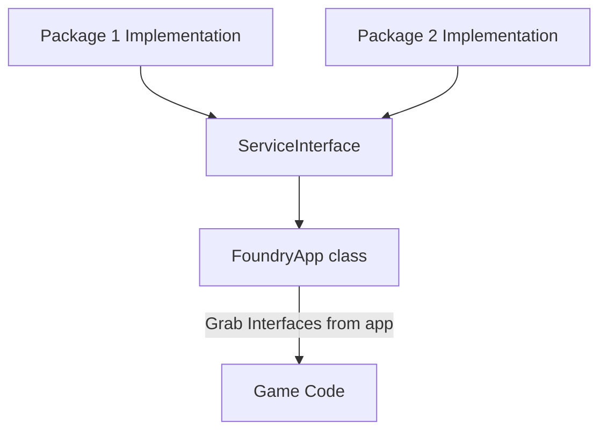

# Modules in Foundry
For foundry to be a modular system, we developed a services based framework that allows both core and packages to define services that can be swapped and used by other packages. This allows us to have a single API for things like networking, and allows us to swap out the implementation of that API depending on the package you have installed. It also provides a way for packages to provide services that other packages can use.

## How it works

Foundry is built on the idea of modules, which while technically independent from Unity packages, there's usually one foundry module per Unity package. 

Each module provides a couple of things that are automatically read from it. A name, source package, and a list of services it both provides and uses. 

Once the config manager has scanned all of our packages for what services they use and provide it'll create a few scriptable assets in the `Assets/Foundry` folder that store which modules should provide which services, as well as a list of all the modules that are installed and should be loaded.

Then when an app is running you can grab an interface by calling `FoundryApp.GetService<T>()` where T is the interface you want to grab. What it returns is based on which module you selected to provide that service in the config manager.



# Creating a Module
Let's say you want to create a module that provides a service that other packages can use. First step is creating a new Unity package. We provide a [GitHub template](https://github.com/FoundryXR/FoundryUnityPackageTemplate) for this, or you can create one from scratch using the docs from Unity:
> [!Video https://www.youtube.com/embed/mgsLb3TKljk]

After this we'll need to create two things for our module to function:
1. [Module Config](#module-config)
2. [Module Definition](#module-definition)


## Module Config
The module config is a scriptable object that inherits from `Foundry.FoundryModuleConfig`. This is where you can store easily accessible settings for your module that will show up directly in the config manager, and it is also where foundry will store enabled services for your module behind the scenes.

Here's Foundry Core's module config as an example:

```cs
/// <summary>
/// Contains all settings to do with the foundry core package, not to be confused with the foundry app config, which stores settings about the application as a whole.
/// </summary>
public class FoundryCoreConfig : FoundryModuleConfig
{
    // We don't have any settings here, but if we did they would be serialized and show up in the config manager.
    // For example if we had a setting called "Enable Debug Logging" we could do this:
    // public bool enableDebugLogging = false;
    // And it would show up in the config manager as a toggleable setting.

#if UNITY_EDITOR
    // This is a helper function that I like defining for singleton scriptable objects, not required but suggested
    public static FoundryCoreConfig GetAsset()
    {
        // If you use this function remember to the asset name in the path so that you're not overwriting other assets.

        var asset = UnityEditor.AssetDatabase.LoadAssetAtPath<FoundryCoreConfig>(
            "Assets/Foundry/Settings/FoundryCoreConfig.asset");  
        if (asset == null)
        {
            asset = CreateInstance<FoundryCoreConfig>();
            Directory.CreateDirectory("Assets/Foundry/Settings");
            UnityEditor.AssetDatabase.CreateAsset(asset, "Assets/Foundry/Settings/FoundryCoreConfig.asset");
        }
        return asset;
    }
#endif

    // This is the important part, this is where we give foundry constructors for all the services that we provide. 
    // The reason we provide callbacks instead of directly calling new, is so that behind the scenes foundry can
    // pick and choose which implementation of a service to use, depending on the current config.
    // So if there was a third party package installed that provided a different implementation of ISceneNavigator,
    // the callback here for it would not be called, and the third party implementation would be used instead.
    // But all the other services would still be provided by this module, if they're still enabled.
    public override void RegisterServices(Dictionary<Type, ServiceConstructor> constructors)
    {
        constructors.Add(typeof(ISceneNavigator), () => new SceneNavigator());
        constructors.Add(typeof(IPlayerRigManager), () => new PlayerRigManagerService());
        constructors.Add(typeof(IFoundryCameraManager), () => new FoundryCameraManager());
    }
}
```

Now in your module code, if you have settings defined in here that you want to access you can do so by calling `FoundryApp.GetConfig<T>()` where T is the type of your module config. This will return a reference to the config asset that you can then access your settings from.

## Module Definition
The module definition is simply a class that implements `Foundry.Core.Editor.IModuleDefinition`. This class is responsible for telling Foundry what services your module provides and uses. 

Make sure you mark this code as editor only, as it's only used by the config manager. And references will break if you try to use it in game code.

Here's how we define the module for Foundry Core (Yes, even foundry core itself is a module!):

```cs
public class FoundryCoreModuleDefinition: IModuleDefinition
{
    public string ModuleName()
    {
        return "Foundry Core";
    }

    // This is where we tell the config manager what services this module provides.
    public List<ProvidedService> GetProvidedServices()
    {
        // These are the default implementations of the services that Foundry Core provides.
        // Since they're defined as services, if someone wants to replace them with their own implementation they can.
        return new List<ProvidedService>
        {
            new ProvidedService
            {
                ImplementationName = "Core Scene Navigator",
                ServiceInterface = typeof(ISceneNavigator)
            },
            new ProvidedService
            {
                ImplementationName = "Core Player Rig Manager",
                ServiceInterface = typeof(IPlayerRigManager)
            },
            new ProvidedService
            {
                ImplementationName = "Core Camera Manager",
                ServiceInterface = typeof(IFoundryCameraManager)
            }
        };
    }

    // Provide a list of services that this module uses.
    public List<UsedService> GetUsedService()
    {
        // These are the services that Foundry Core requires to function.
        // The reason that we still report these as used even if we provide them is so that if someone wants to 
        // replace them with their own implementation they can. Also if a service is not marked as required by at 
        // least one module a provider won't be automatically chosen and a lot of bugs might happen.
        // These also show up in the config manager so that users can see what services are required by each module.
        return new List<UsedService>
        {
            new UsedService
            {
                optional = false,
                ServiceInterface = typeof(ISceneNavigator)
            },
            new UsedService
            {
                optional = false,
                ServiceInterface = typeof(IPlayerRigManager)
            },
            new UsedService
            {
                optional = false,
                ServiceInterface = typeof(IFoundryCameraManager)
            },
            new UsedService
            {
                optional = false,
                ServiceInterface = typeof(INetworkProvider)
            }
        };
    }

    // This should always return a reference to the module config asset, or create one if it doesn't exist.
    // The preferred path for this is Assets/Foundry/Settings/YourConfig.asset
    public FoundryModuleConfig GetModuleConfig()
    {
        // This is that same helper function from the module config, you can see how it makes this whole workflow a lot easier.
        return FoundryCoreConfig.GetAsset();
    }
}
```


## Service Definitions and Implementations
Now that we know how to define a module, let's look at how to define a service.

A service is just a regular C# interface that defines a set of functionality. Lets take a the IPlayerRigManager service as an example. The way that the player rig works in foundry is that it's created once on startup, and then "borrowed" by interaction rigs like NetworkPlayer or MenuPlayer as an input source (this is how we handle things like async loading and whatnot)

So the `IPlayerRigManager` interface defines all the needed interfaces, and then `PlayerRigManagerService` Is the class that actually defines the functionality. (If you look above in the module config you can see that we provide a callback that returns a new instance of `PlayerRigManagerService`)

```cs
public delegate void PlayerRigEvent(IPlayerControlRig rig);

/// <summary>
/// Service to manage the lifecycle of the player rig.
/// </summary>
public interface IPlayerRigManager
{
    /// <summary>
    /// Grab the current instantiated player rig.
    /// </summary>
    public IPlayerControlRig Rig { get; }

    /// <summary>
    /// Register player rig after it's been created, along with the place to put it when it's not in use (Usually while loading)
    /// </summary>
    public void RegisterRig(IPlayerControlRig rig, Transform unusedRigHolder);

    /// <summary>
    /// Register the rig as in use
    /// </summary>
    public IPlayerControlRig BorrowPlayerRig();

    /// <summary>
    /// Register the rig as no longer in use
    /// </summary>
    public void ReturnPlayerRig();

    /// <summary>
    /// Event that fires when the player rig is first created.
    /// </summary>
    public event PlayerRigEvent PlayerRigCreated;

    public event PlayerRigEvent PlayerRigBorrowed;
    public event PlayerRigEvent PlayerRigReturned;
}
```

All you would need to do for Foundry to use a new system for managing player rigs is:
1. Create a new implementation of `IPlayerRigManager`
2. Add it to the list of provided services in your module definition
3. add a constructor to your module config that returns a new instance of your implementation.

Now you're all set! Let's see what modules you build!